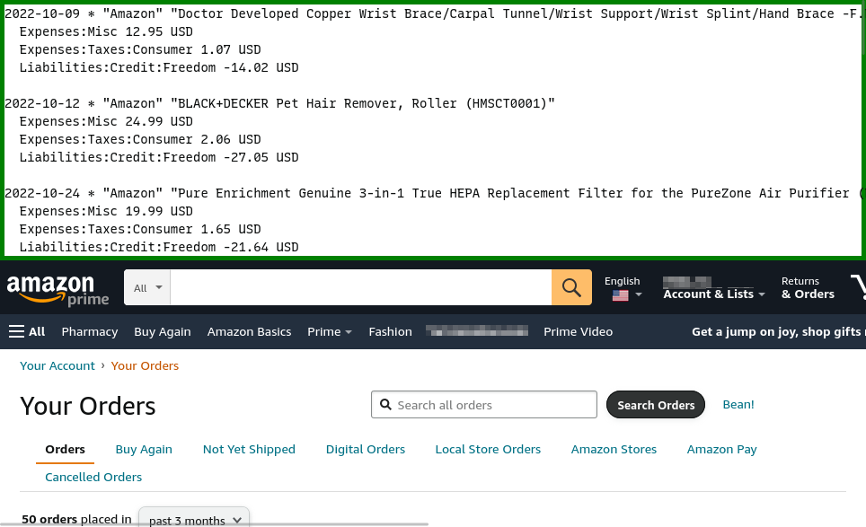

= Beancount Generator for Amazon

A browser extension to generate
https://beancount.github.io/[Beancount] entries from Amazon orders. I
had a
https://github.com/MetroWind/small-tools/tree/master/amazon-beancount[Rust
program] to do this, which requires me to download
https://www.amazon.com/gp/b2b/reports[b2b order reports] from Amazon.
However the Amazon quite frequently fails to export b2b reports. So I
write this browser extension that does not depend on that.

== Usage

Go to the order history page, usually at
`https://www.amazon.com/gp/css/order-history`. You should see a link
called “Bean!” next to the “Search Orders” button. Click it and wait.
It should generate a wall of text and put it on the top of the web
page.

image::shot-bean.png[Bean button]

When you click the “Bean!” link, it finds all the orders in the
current page, and retrieve the invoice of each. From the invoice it
scraps the necessary info and constructs the Beancount entries.

